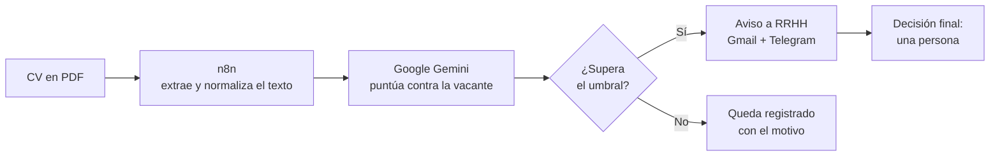

 

---

## Sobre mí

Construyo aplicaciones que funcionan de punta a punta con **JavaScript** y **Python**, sin apoyarme en frameworks, y automatizo con **n8n** procesos que antes se hacían a mano.

No vengo de una carrera tradicional de sistemas. Me formo en **Campuslands**, donde cada módulo se aprueba entregando software que funciona, y ahora mismo profundizo en bases de datos relacionales y metodologías ágiles.

Busco mi primera oportunidad como desarrollador junior.

---

## Proyecto destacado

### Preselección Inteligente de Candidatos

Un reclutador que recibe 200 CVs dedica días a la primera criba. Este flujo la resuelve en minutos: lee cada CV en PDF, lo evalúa contra los requisitos reales de la vacante y avisa al equipo de RRHH solo de los perfiles que valen la pena — **dejando siempre la decisión final en una persona.**

**n8n** · **Google Gemini** · **JavaScript** · **Gmail API** · **Telegram Bot API**

[Ver el código →](https://github.com/Eidan210/Proyecto_n8n)

---

## Stack

| Área | Tecnologías |
| :--- | :--- |
| **Lenguajes** | Python · JavaScript (ES6+) · Java · SQL |
| **Frontend** | HTML5 semántico · CSS3 (Grid, Flexbox) · DOM · Diseño responsive |
| **Datos y APIs** | PostgreSQL · JSON · APIs REST (Fetch) |
| **Automatización e IA** | n8n · Google Gemini |
| **Entorno** | Git · GitHub · VS Code · Linux · Bash |

> En formación activa: modelado relacional y Scrum.

---

## Otros proyectos

| Proyecto | Qué resuelve | Stack |
| :--- | :--- | :--- |
| **[Mym Designsx](https://github.com/Eidan210/Proyecto-Automatizacion-mym)** · [demo ↗](https://eidan210.github.io/Proyecto-Automatizacion-mym/) | Tienda de prendas personalizables: catálogo con filtros, personalizador, carrito con IVA y checkout que envía el recibo al cliente | JS vanilla · n8n · PostgreSQL |
| **[Portafolio personal](https://github.com/Eidan210/portafolio-junior)** · [demo ↗](https://eidan210.github.io/portafolio-junior/) | Sitio estático sin dependencias ni build, mobile-first y accesible (WCAG AA) | HTML · CSS · JS |
| **[Control de APIs](https://github.com/Eidan210/Control-De-Apis-JS)** | Cliente web sobre la API de RAWG con un mensaje de error distinto para cada caso de fallo, en vez de un genérico | JavaScript · Fetch API |

<b>Proyectos de consola en Python</b>

 

| Proyecto | Qué resuelve | Stack |
| :--- | :--- | :--- |
| **[CampusTech v2.0](https://github.com/Eidan210/CampusTech-V2.0-Eidan)** | Inventario tecnológico repartido en cinco módulos con persistencia en JSON. Reescritura modular de una primera versión monolítica | Python · JSON |
| **[Simulador de Gasto Diario](https://github.com/Eidan210/Moneda)** | Registro de gastos con totales diarios, semanales y mensuales, en seis módulos independientes | Python · JSON |

---

## Cómo trabajo

- **Diagnóstico antes que parche.** Reproduzco el fallo, aíslo la causa y corrijo el origen, no el síntoma.
- **Commits atómicos** con [Conventional Commits](https://www.conventionalcommits.org/es/v1.0.0/) e historial legible, en vez de un volcado de cambios al final.
- **README que explica la decisión tomada**, no solo cómo se instala.
- **Nativo antes que dependencia.** Mido lo que cuesta mantener algo antes de instalarlo.

---

## Contacto

El canal más rápido es el correo. Respondo el mismo día.

