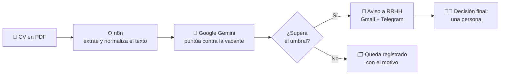

<!-- ═══════════════ CABECERA ANIMADA ═══════════════ -->

  

  

<a href="#sobre-mi"><b>Sobre mí</b></a> &nbsp;│&nbsp;
<a href="#destacado"><b>Proyecto destacado</b></a> &nbsp;│&nbsp;
<a href="#stack"><b>Stack</b></a> &nbsp;│&nbsp;
<a href="#proyectos"><b>Proyectos</b></a> &nbsp;│&nbsp;
<a href="#metodo"><b>Método</b></a> &nbsp;│&nbsp;
<a href="#contacto"><b>Contacto</b></a>

  

 

<!-- ═══════════════ SOBRE MÍ ═══════════════ -->

 

<table align="center" width="760">
  <tr>
    <td align="center">
       
      Construyo aplicaciones que funcionan de punta a punta con <b>JavaScript</b> y <b>Python</b>, sin apoyarme en frameworks, y automatizo con <b>n8n</b> procesos que antes se hacían a mano.
        
      No vengo de una carrera tradicional de sistemas. Me formo en <b>Campuslands</b>, donde cada módulo se aprueba entregando software que funciona. Ahora mismo profundizo en <b>bases de datos relacionales</b> y <b>metodologías ágiles</b>.
        
      <b>Busco mi primera oportunidad como desarrollador junior:</b> 
      un equipo donde pueda aportar desde el primer sprint y seguir creciendo.
        
    </td>
  </tr>
</table>

 

<!-- ═══════════════ PROYECTO DESTACADO ═══════════════ -->

 

<h3>Preselección Inteligente de Candidatos</h3>

<i>De 200 CVs a una lista corta en minutos, con la decisión final siempre en manos de una persona.</i>

  

Un reclutador que recibe 200 CVs dedica días a la primera criba. 
Este flujo la resuelve en minutos: lee cada CV en PDF, lo evalúa contra los requisitos reales de la vacante 
y avisa al equipo de RRHH <b>solo de los perfiles que valen la pena</b>.

```mermaid
flowchart LR
    A["📄 CV en PDF"] --> B["⚙️ n8n<br/>extrae y normaliza el texto"]
    B --> C["🤖 Google Gemini<br/>puntúa contra la vacante"]
    C --> D{"¿Supera<br/>el umbral?"}
    D -- Sí --> E["📨 Aviso a RRHH<br/>Gmail + Telegram"]
    D -- No --> F["🗂️ Queda registrado<br/>con el motivo"]
    E --> G["🧑‍💼 Decisión final:<br/>una persona"]
```

<table align="center" width="760">
  <tr>
    <td align="center" width="33%"><b>PROBLEMA</b> La primera criba manual de cientos de CVs consume días.</td>
    <td align="center" width="33%"><b>SOLUCIÓN</b> Extracción, evaluación con IA contra la vacante y notificación automática.</td>
    <td align="center" width="33%"><b>CRITERIO</b> Los descartados quedan registrados con el motivo; la decisión final nunca se automatiza.</td>
  </tr>
</table>

 

  

 

<!-- ═══════════════ STACK ═══════════════ -->

 

  

  

<table align="center" width="760">
  <tr>
    <td align="center" width="28%"><b>Lenguajes</b></td>
    <td align="center">Python · JavaScript (ES6+) · Java · SQL</td>
  </tr>
  <tr>
    <td align="center"><b>Frontend</b></td>
    <td align="center">HTML5 semántico · CSS3 (Grid, Flexbox) · DOM · Diseño responsive</td>
  </tr>
  <tr>
    <td align="center"><b>Datos y APIs</b></td>
    <td align="center">PostgreSQL · JSON · APIs REST (Fetch)</td>
  </tr>
  <tr>
    <td align="center"><b>Automatización e IA</b></td>
    <td align="center">n8n · Google Gemini</td>
  </tr>
  <tr>
    <td align="center"><b>Entorno</b></td>
    <td align="center">Git · GitHub · VS Code · Linux · Bash</td>
  </tr>
  <tr>
    <td align="center"><b>En formación activa</b></td>
    <td align="center">Modelado relacional avanzado · Scrum</td>
  </tr>
</table>

 

<!-- ═══════════════ PROYECTOS ═══════════════ -->

 

<table align="center" width="800">
  <tr>
    <td align="center" width="50%" valign="top">
       
      <b><a href="https://github.com/Eidan210/Proyecto-Automatizacion-mym">Mym Designsx</a></b>
        
      Tienda de prendas personalizables: catálogo con filtros, personalizador, carrito con IVA y checkout que envía el recibo al cliente.
        
      
      
      
        
      <a href="https://github.com/Eidan210/Proyecto-Automatizacion-mym">Código</a> &nbsp;·&nbsp; <a href="https://eidan210.github.io/Proyecto-Automatizacion-mym/">Demo ↗</a>
        
    </td>
    <td align="center" width="50%" valign="top">
       
      <b><a href="https://github.com/Eidan210/portafolio-junior">Portafolio personal</a></b>
        
      Sitio estático sin dependencias ni build, mobile-first y accesible (WCAG AA).
        
      
      
      
        
      <a href="https://github.com/Eidan210/portafolio-junior">Código</a> &nbsp;·&nbsp; <a href="https://eidan210.github.io/portafolio-junior/">Demo ↗</a>
        
    </td>
  </tr>
  <tr>
    <td align="center" valign="top">
       
      <b><a href="https://github.com/Eidan210/Control-De-Apis-JS">Control de APIs</a></b>
        
      Cliente web sobre la API de RAWG con un mensaje de error distinto para cada caso de fallo, en vez de uno genérico.
        
      
      
        
      <a href="https://github.com/Eidan210/Control-De-Apis-JS">Código</a>
        
    </td>
    <td align="center" valign="top">
       
      <b><a href="https://github.com/Eidan210/CampusTech-V2.0-Eidan">CampusTech v2.0</a></b>
        
      Inventario tecnológico en cinco módulos con persistencia en JSON. Reescritura modular de una primera versión monolítica.
        
      
      
        
      <a href="https://github.com/Eidan210/CampusTech-V2.0-Eidan">Código</a>
        
    </td>
  </tr>
  <tr>
    <td align="center" colspan="2" valign="top">
       
      <b><a href="https://github.com/Eidan210/Moneda">Simulador de Gasto Diario</a></b>
        
      Registro de gastos con totales diarios, semanales y mensuales, en seis módulos independientes.
        
      
      
        
      <a href="https://github.com/Eidan210/Moneda">Código</a>
        
    </td>
  </tr>
</table>

 

<!-- ═══════════════ MÉTODO ═══════════════ -->

 

<table align="center" width="800">
  <tr>
    <td align="center" width="50%" valign="top">
       
      <b>🔍 Diagnóstico antes que parche</b>  
      Reproduzco el fallo, aíslo la causa y corrijo el origen, no el síntoma.
        
    </td>
    <td align="center" width="50%" valign="top">
       
      <b>🧩 Commits atómicos</b>  
      <a href="https://www.conventionalcommits.org/es/v1.0.0/">Conventional Commits</a> e historial legible, en vez de un volcado de cambios al final.
        
    </td>
  </tr>
  <tr>
    <td align="center" valign="top">
       
      <b>📝 README que explica la decisión</b>  
      Documento por qué se hizo así, no solo cómo se instala.
        
    </td>
    <td align="center" valign="top">
       
      <b>🪶 Nativo antes que dependencia</b>  
      Mido lo que cuesta mantener algo antes de instalarlo.
        
    </td>
  </tr>
</table>

 

<!-- ═══════════════ ACTIVIDAD ═══════════════ -->

 

  

 

<!-- ═══════════════ CONTACTO ═══════════════ -->

 

<b>El canal más rápido es el correo. Respondo el mismo día.</b>

  

  

<i>Gracias por pasar. Si algo de lo que ves te interesa, escríbeme.</i>

